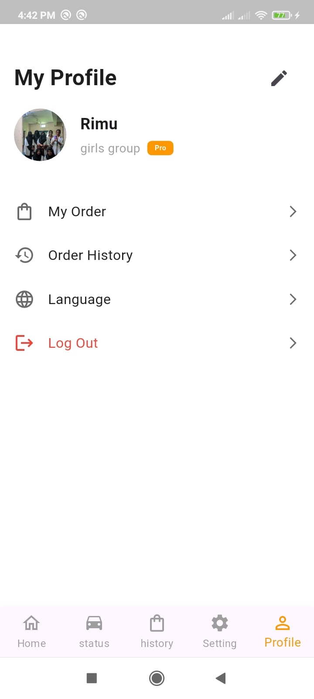
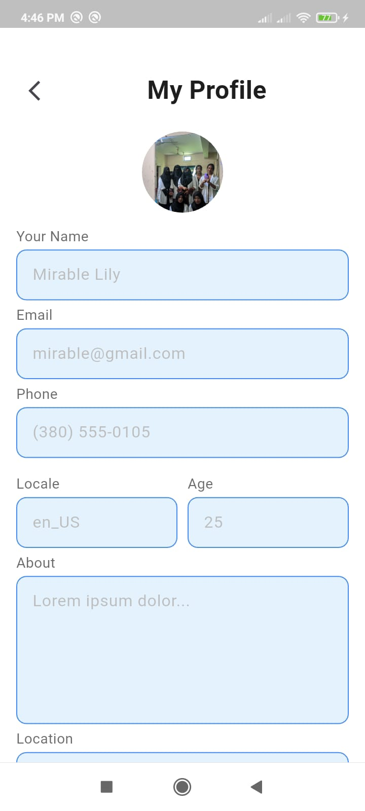
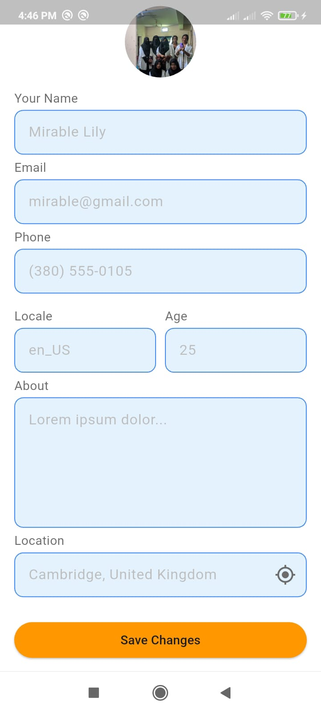
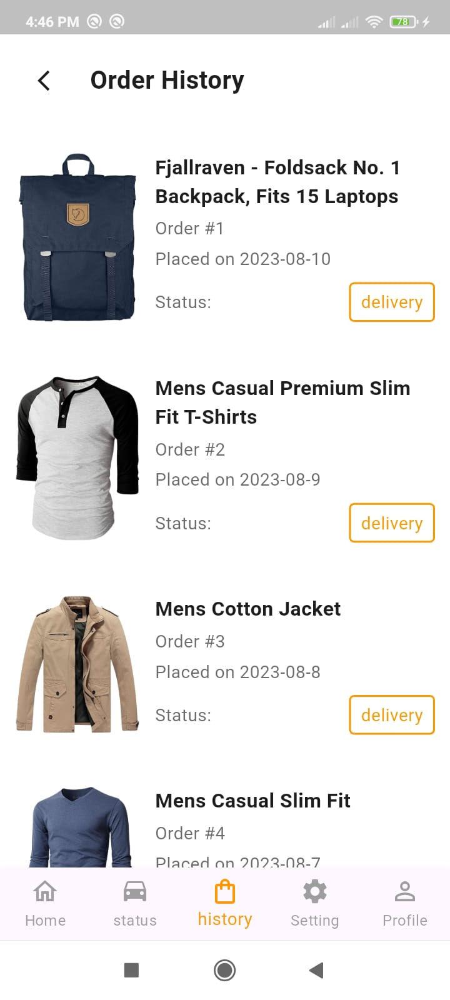
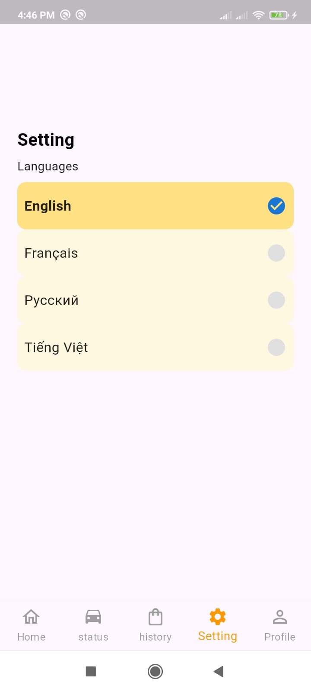
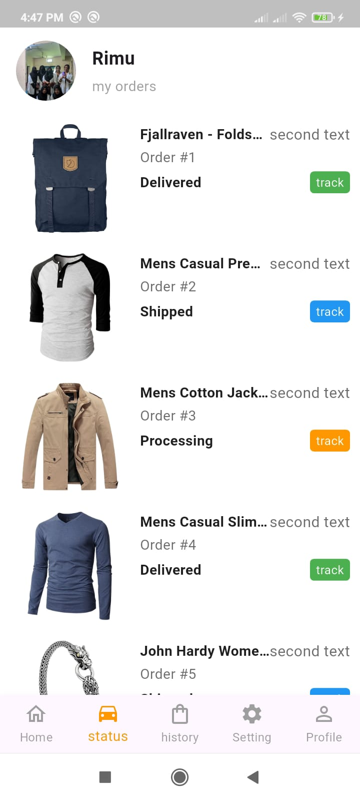

# Interview_Task App 📖

## 🖼 App Screenshots

### 🔹 Row 1

  
  
  
  

### 🔹 Row 2

  
  
  

---

## 🛠️ Technologies Used

This app is built with the following technologies:

- 🔹 **Flutter** (UI development)
- 🔹 **Dart** (Programming Language)
- 🔹 **Riverpod** (State Management)
- 🔹 **Go Router** (Navigation)
- 🔹 **Responsive UI** (Supports multiple screen sizes)
- 🔹 **Reusable UI Components** (Modular UI elements for consistency)
- 🔹 **REST API / HTTP Requests** (Fetches data from backend services)

## 🛠️ Package Used
http: ^1.5.0
flutter_screenutil: ^5.9.3
go_router: ^16.2.1
flutter_riverpod: ^2.6.1
---

