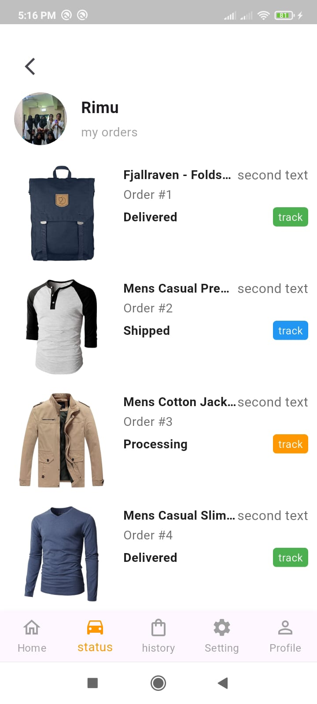

# Interview_Task App 📖

## 🖼 App Screenshots

### 🔹 Row 1

  
  
  
  

### 🔹 Row 2

  
  
  

---

## 🛠️ Technologies Used

This app is built with the following technologies:

- 🔹 **Flutter** (UI development)
- 🔹 **Dart** (Programming Language)
- 🔹 **Riverpod** (State Management)
- 🔹 **Go Router** (Navigation)
- 🔹 **Responsive UI** (Supports multiple screen sizes)
- 🔹 **Reusable UI Components** (Modular UI elements for consistency)
- 🔹 **REST API / HTTP Requests** (Fetches data from backend services)

## 🛠️ Package Used
http: ^1.5.0
flutter_screenutil: ^5.9.3
go_router: ^16.2.1
flutter_riverpod: ^2.6.1

## 🛠️ Structure
lib/
│
├── main.dart
├── app. dart                     # Root widget, app-wide settings
├── routes/                      # Named route definitions
│   └── app_routes.dart
│
├── core/                        # Reusable core utilities, constants,
│   ├── constants/
│   ├── utils/
│   ├── services/                # Common services: network, storage, etc.
│   └── widgets/                 # Reusable widgets (buttons, loaders, etc.)
│
├── business_logic/                        # Data layer (local, remote, models)
│   ├── models/
│   ├── repositories/
│   └── providers/               # APIs
│
├── features/                    
│   ├── order/                   
│   │   ├── screens/
│   │   ├── logic/
│   │   ├── data/
│   │   └── widgets/

---

